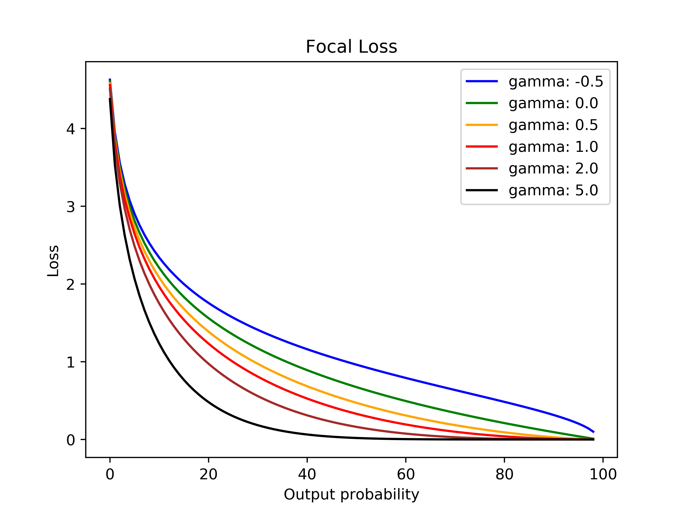

# PyTorch_Focal_Loss

Focal Loss implementation: focal_loss.py <br/>

```python
import torch
device = torch.device("cuda" if cuda_available else "cpu")

gamma_val = torch.Tensor([1]).to(device)
targets = torch.Tensor([0, 1, 0, 1, 1]).to(device)
output_probs = torch.Tensor([0.2, 0.8, 0.3, 0.4]).to(device)
loss = FocalLoss(args, gamma=gamma_val, logits=False)(output_probs, targets)
```

Detailed usage example and test:  
```python
python3 focal_loss_test.py 
```
<br/>



